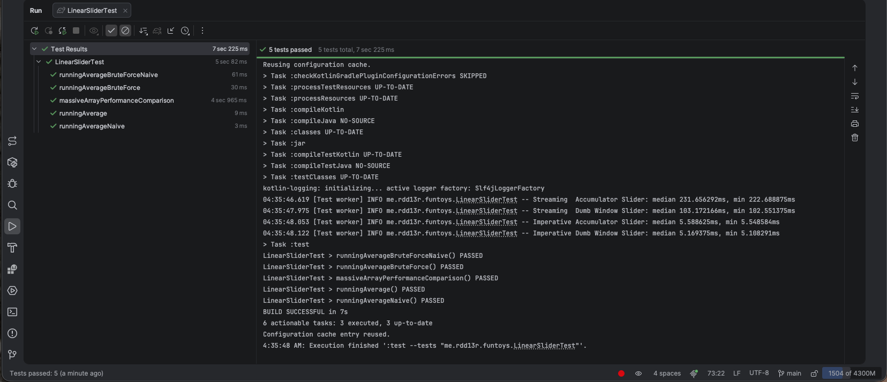

# im-a-sliding-window

This question got me by the bonnet! <br/>
It was during an interview. <be/>
This is a common and simple problem.

But there's a lot of fun to be had here! <be/>
I am borrowing this idea for my own interviews. <be/>
Because simple yet exposing questions are rare.

My interviewer thought running average sum memoise by accumulator is an optimization...

Hm...

Read my article here: https://mimis-gildi.github.io/riddle-me-this//2026/07/26/algos-vs-life.html

And the test is here: `me.rdd13r.funtoys.LinearSliderTest.massiveArrayPerformanceComparison`

-rdd13r

```log
08:06:57.197 [Test worker] INFO me.rdd13r.funtoys.LinearSliderTest -- Streaming  Accumulator Slider: median 224.936125ms, min 217.681708ms
08:06:58.586 [Test worker] INFO me.rdd13r.funtoys.LinearSliderTest -- Streaming  Dumb Window Slider: median 105.571125ms, min 103.747708ms
08:06:58.664 [Test worker] INFO me.rdd13r.funtoys.LinearSliderTest -- Imperative Accumulator Slider: median 5.625750ms, min 5.561042ms
08:06:58.734 [Test worker] INFO me.rdd13r.funtoys.LinearSliderTest -- Imperative Dumb Window Slider: median 5.196167ms, min 5.124416ms
```



